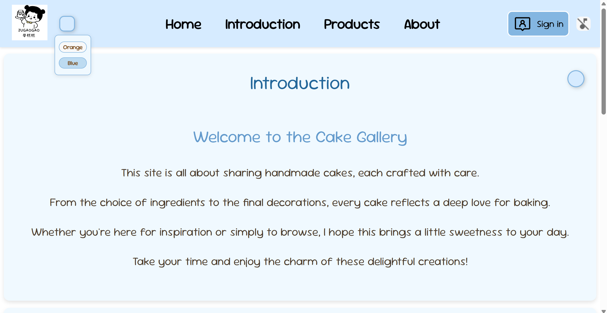
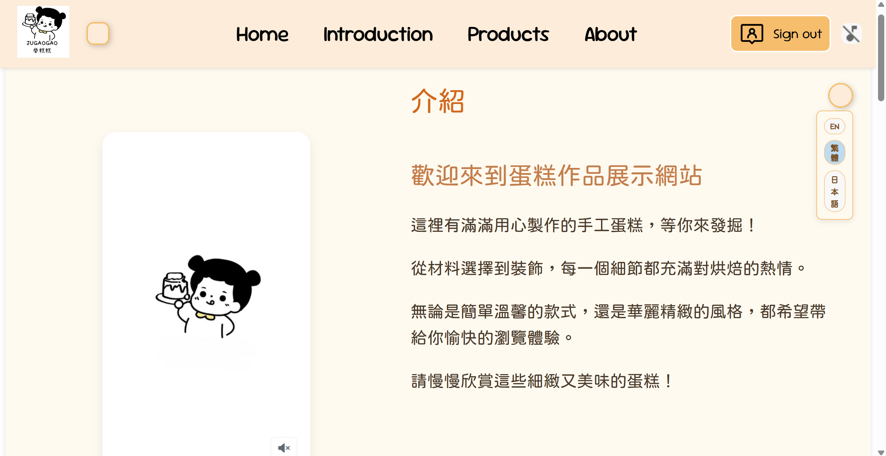
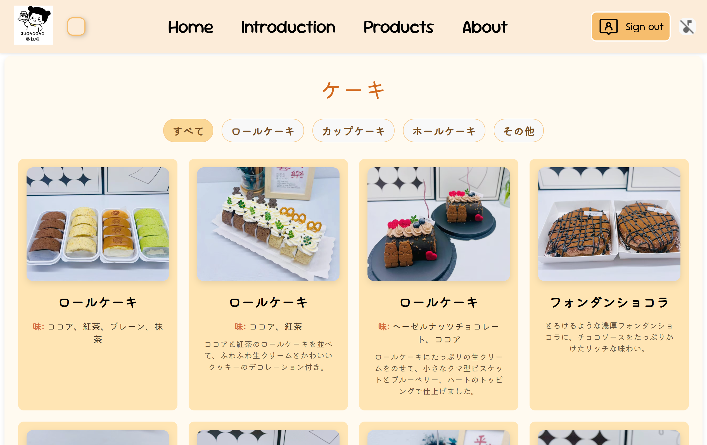
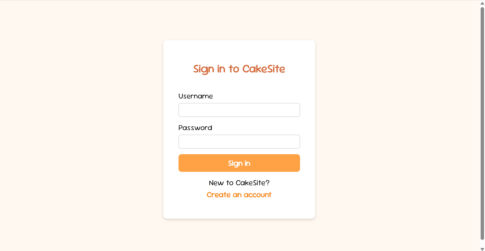
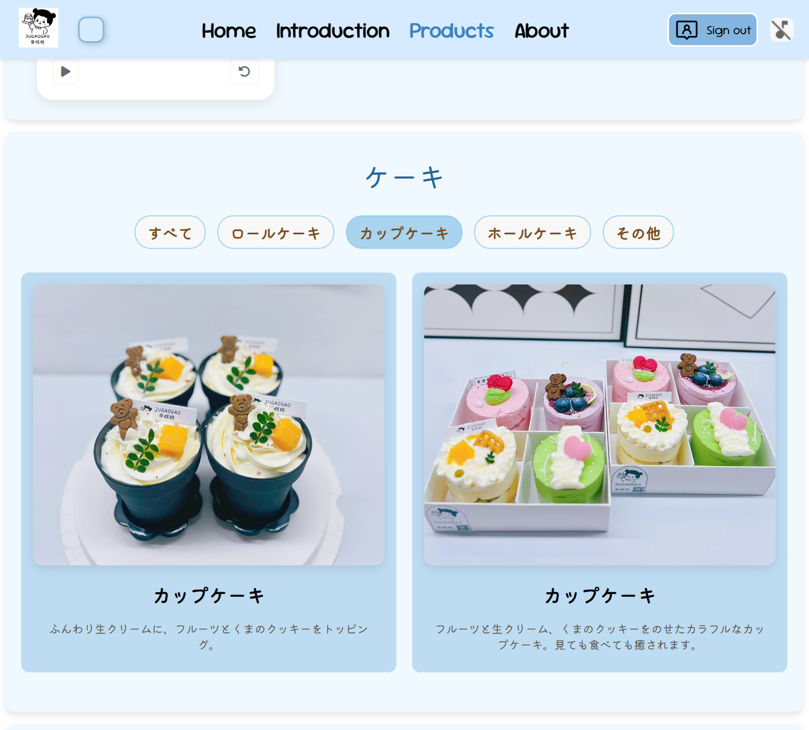
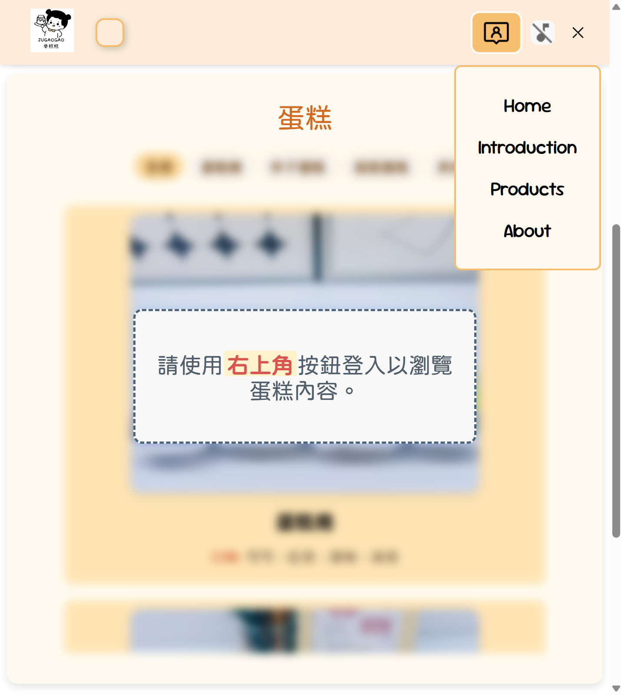
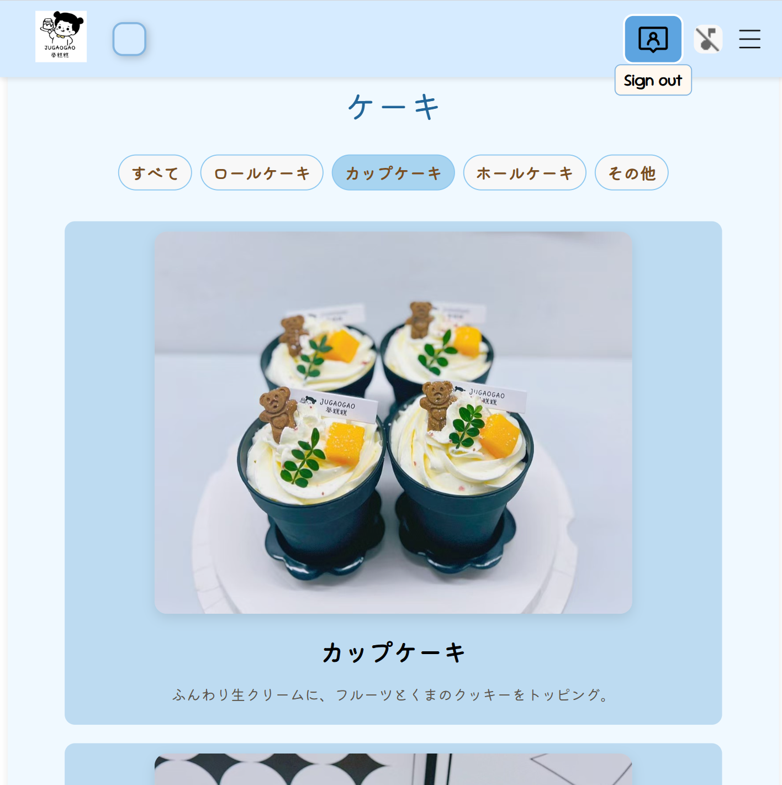

# Cake Gallery Website

---

## English

This is a personal front-end website project built with HTML, CSS, and JavaScript.

It displays a collection of cakes made by a relative, with theme switching (Orange/Blue), multi-language content, and a simulated login system using LocalStorage.

📦 *No back-end or real authentication included. For learning and portfolio purposes only.*

📸 *Images used with permission from the baker.*

---

## 中文

這是一個使用 HTML、CSS 和 JavaScript 製作的個人前端練習網站。

展示的是我親戚所製作的蛋糕，網站具有主題切換（橘 / 藍）、多語言內容（英文 / 繁體中文 / 日文）、登入模擬（LocalStorage）等功能。

📦 *無後端、無真實帳號驗證。*

📸 *圖片已獲製作者同意展示。*

---

## 日本語

HTML、CSS、JavaScript を使って作成した個人のフロントエンド練習プロジェクトです。

親戚が作ったケーキのギャラリーを表示し、テーマの切り替え（オレンジ / ブルー）、多言語対応（英語 / 繁体字中国語 / 日本語）、ローカルストレージによるログイン機能を含んでいます。

📦 *サーバーや実際の認証機能は含まれていません。*

📸 *写真は製作者の許可を得て掲載しています。*

---
## 📸 Preview

### 🖼️ Home Page
*Guest view (before login)*

  

### 🎨 Theme Switching

  

### 🌐 Language Options
*Logged-in view*

  
  

### 🔐 Login Page

  

### 📱 Tablet View

  

### 📱 Mobile View

  
  

## 🌟 Features

- Theme switching (Orange / Blue)
- Multi-language content (EN / Traditional Chinese / Japanese)
- Dynamic cake rendering from data (cakeData.js)
- Lightbox image viewer (with prev/next navigation)
- Custom video player (play, pause, replay, volume, fullscreen)
- Background music toggle (auto-pauses when video plays)
- Login simulation (via LocalStorage)
- Responsive mobile-friendly design (custom menu, flexible layout)
- Modular JavaScript structure for maintainability

## 🛠️ Built With

- HTML5 / CSS3
- JavaScript (Vanilla, ES Modules)
- LocalStorage (login simulation)
- Responsive design (Media Queries, custom mobile menu)

## 🚀 How to Run

This project is deployed using GitHub Pages.

You can visit the website directly at:
https://shinoMyu.github.io/cake/

No local server setup is required.